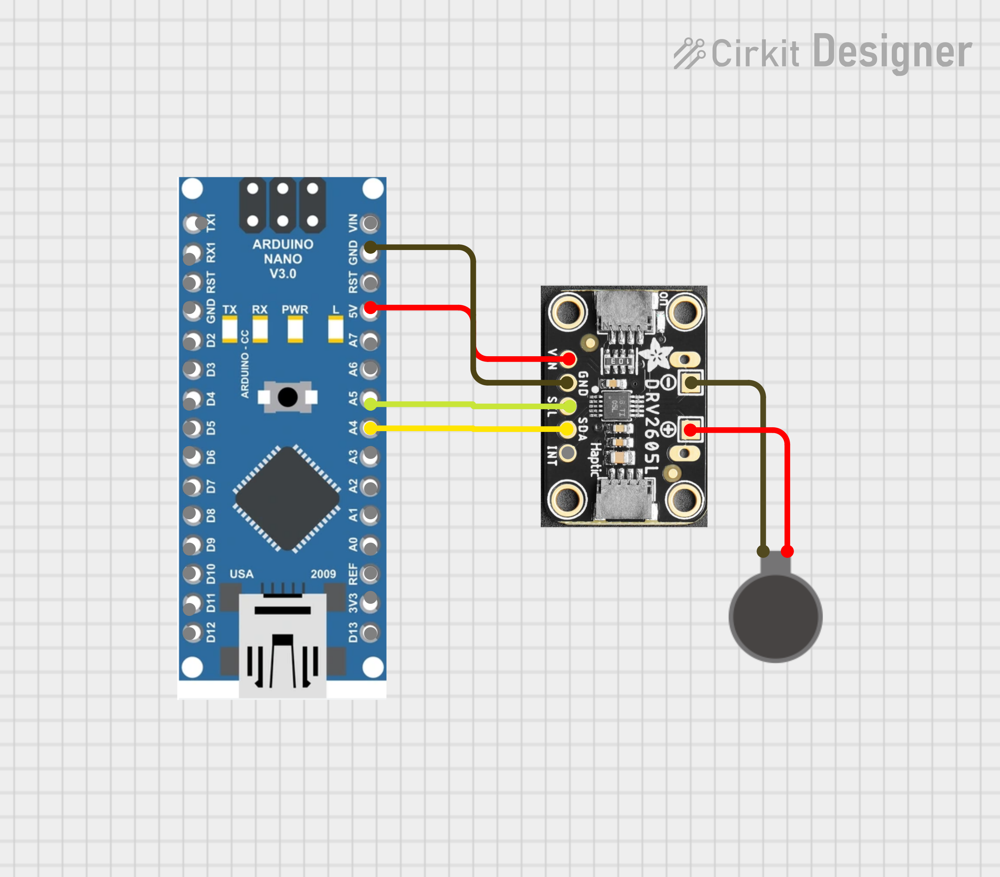

# DIY Force Feedback Kupplungspedal (Active Pedal Clutch)

## Projektübersicht

Ein haptisches Force-Feedbacksystem für Sim-Racing Pedale, das den Schleifpunkt einer Kupplung physikalisch simuliert. Dabei wird mechanisches Rupfen, Motionvibrationen und das Feedback beim Verschalten spürbar gemacht.

## Struktur

- Zyklen
- SMART Ziele

## Hardware

### Komponentenliste V3.1

| Komponente | Modell | Funktion |
| -------- | ------- | ------- |
| Audio Verstärker | | Verstärker und Stromquelle für Aktuator |
| Aktuator | Grewus HapForce 2 VCA (Voice Coil Actuator) | Vibriert mithilfe von Audio |
| Halterung | 3D-Druck | Befestigung am Kupplungspedal |
| Kupplungspedal | Fanatec V3i Pedals | - |

### Schaltplan V3.1

___

### Komponentenliste V3.2

| Komponente | Modell | Funktion |
| -------- | ------- | ------- |
| Microcontroller | Arduino Nano v3 | Schnittstelle zwischen PC und Motor |
| Motor Treiber | Adafruit DRV2605L | Haptik-Controller und I2C |
| Aktuator | Generic ERM Motor (Eccentric Rotating Mass) | Vibriert |
| Halterung | Metallstück | Befestigung am Kupplungspedal |
| Kupplungspedal | Fanatec V3i Pedals | - |

### Schaltplan V3.2

___

- Buttshaker
- LRA

## Software & Logik

### Arduino Firmware V3.2

### SimHub: Custom Plugin

(Insert Link to Plugin)

Mithilfe eines Custom Plugins werden über UDP Telemetrie Daten empfangen und  als Custom Properties angelegt.

### SimHub: ShakeIt Bass Shakers V3.1 und Custom serial devices V3.2

#### Konfiguration von Custom game (V3.1)

Home --> Setting Symbol unter "My favorite simulators" --> Custom games --> Create new custom game --> Launcher action -->

1. (Automatic game activation) Enter process names under "Process detection" --> Activate "Automatic game activation"
2. Select correct executable for "Target" (if necessary set Arguments)

(Make Video?)

#### Konfiguration ShakeIt Bass Shakers (V3.1)

ShakeIt Bass Shakers --> Sound Output --> Add sound output --> Effects Profile --> Add effect --> Custom Effect --> Open added Custom Effect (scroll far down) --> Select Mono for Mode --> EDIT (any of the 4) --> Use Javascript --> Insert Script in next chapter into Javascript Textbox --> Ok

For Frequencies I used 38 but these settings do not matter too much and are different per person.

#### Konfiguration von "Custom serial devices" für V3.2

Custom serial device --> Add new serial device --> Identify (do what it says) --> Baudrate to 19200 --> Enable RTS, DTR (if not already) --> Add new message under "Update messages" (or EDIT existing one) --> Use Javascript --> Insert Script in next chapter into Javascript Textbox --> Ok --> Activate it

#### Logik für beide Skripte

(Insert Link to Scripts)

deltaRPM = engineRPM - transmissionRPM
if:
engineRPM 0
deltaRPM 0
deltaRPM engineRPM

### Debugging

UDP with sender
Simulations c++ udp
Support for Linux
JSON format sending

## Erkenntnisse, Testergebnisse, Reviews
